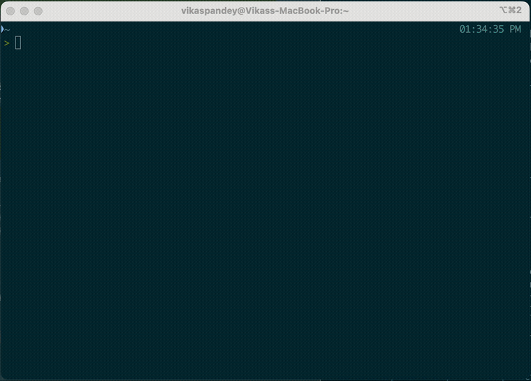

<div align="center">

# portctl

**A developer-first CLI for understanding and managing local network ports.**

[](https://github.com/vikas0686/portctl/actions/workflows/ci.yml)
[](https://github.com/vikas0686/portctl/releases)
[](LICENSE)



</div>

---
## The problem

Every developer has some version of this, several times a week:

```
$ npm run dev
Error: listen EADDRINUSE: address already in use :::3000
```

What follows is a small ritual: `lsof -i :3000`, squint at the columns,
copy a PID, `kill -9` it, hope it wasn't something else. And if that
doesn't fix it, there's a second, more confusing question underneath —
is something actually listening? Is this a leftover Docker container? A
zombie from a crashed process? Or is the port stuck in some kernel state
that has nothing to do with a "real" conflict at all?

The tools that are supposed to answer this were built for sysadmins
auditing a server, not developers iterating on a laptop:

| Tool | Good at | Falls short on |
|---|---|---|
| `lsof` | Exhaustive, authoritative | Cryptic flags, no color, not on Windows, slow `-i` scans on macOS |
| `ss` | Fast, modern | Linux-only, terse output, no process-friendly naming |
| `netstat` | Universally present | Deprecated on Linux, inconsistent flags per OS, no kill capability |
| `fuser` | One-shot kill-by-port | No listing, no context, no safety rails |
| `kill-port` (npm) | Zero-config | Needs a Node runtime, no real cross-platform binary, no diagnosis |

None of them are cross-platform, none of them explain *why* something is
happening, and none of them were designed as a product — they're syscalls
with a CLI face.

## Why portctl?

`portctl` treats a **port** as the durable, addressable thing worth asking
about — not the process that happens to be bound to it right now. That
flip matters: processes are ephemeral (PIDs come and go, servers restart),
but developers think in terms of stable ports — "3000 is my frontend,"
"5432 is postgres." Every existing tool gets this backwards, showing a
process table filtered by port instead of an answer about the port itself.

In practice:

- **A verdict, not a table.** `portctl why 8080` explains *why* a port is
  behaving unexpectedly in plain English, instead of raw kernel state you
  have to interpret yourself.
- **Answers even when nothing is listening.** A `TIME_WAIT` socket left
  behind by a process that already exited is still worth explaining —
  most tools just show you nothing.
- **Cross-platform by default**, one static binary, no runtime dependency.
- **No background daemon.** Everything is point-in-time; nothing runs
  when you're not asking it to.

## Install

**Homebrew** (macOS/Linux):

```sh
brew install vikas0686/portctl/portctl
```

**curl** (macOS/Linux, no Homebrew required):

```sh
curl -fsSL https://raw.githubusercontent.com/vikas0686/portctl/main/install.sh | sh
```

**From source:**

```sh
git clone https://github.com/vikas0686/portctl.git
cd portctl
go build -o portctl ./cmd/portctl
```

Requires Go 1.22+. No third-party dependencies.

> Homebrew and curl installs pull prebuilt binaries from [GitHub
> Releases](https://github.com/vikas0686/portctl/releases) — these don't
> exist until the first tagged release ships.

## Quick Start

### See what's listening

```sh
$ portctl ls

PROTO  PORT   PID    PROCESS   STATE
tcp    3000   82013  node      LISTEN
tcp    5432   1204   postgres  LISTEN
```

---

### Inspect a port

Get everything `portctl` knows about a specific port.

```sh
$ portctl 3000
```

```text
3000/tcp LISTEN

Owner:   node (pid 82013)
Command: node server.js --port 3000
Cwd:     ~/projects/web
```

Need more detail?

```sh
$ portctl 3000 --cpu --memory
```

```text
CPU:     0.4%
Memory:  86.2 MB
```

---

### Understand *why* a port behaves the way it does

`why` doesn't just tell you what's happening—it explains it.

```sh
$ portctl why 3000
```

```text
3000/tcp TIME_WAIT

The process that owned this connection has already exited, but the
kernel is still holding the socket in TIME_WAIT.

This commonly happens immediately after restarting a server and is
usually why you see:

  address already in use

The socket will typically be released within ~30 seconds.
```

---

### Free a port

Gracefully stop the process using a port.

```sh
$ portctl kill 3000
```

Skip confirmation:

```sh
$ portctl kill 3000 --yes
```

Force kill if needed:

```sh
$ portctl kill 3000 --force
```

---

### Watch ports live

Leave a live view running in a spare pane — refreshes on an interval and
flags what showed up or disappeared since the last refresh.

```sh
$ portctl watch
```

```text
portctl watch — every 1s — 14:32:07 — ctrl-c to quit

PROTO  PORT   PID    PROCESS   STATE
tcp    3000   82013  node      LISTEN
tcp    5432   1204   postgres  LISTEN

+ tcp/3000 node (pid 82013)
```

Narrow it to one port, and control the refresh rate:

```sh
$ portctl watch 3000 -n 2
```

## Commands

| Command | What it does | Example |
|---|---|---|
| `portctl ls` | List everything listening locally. Bare `portctl` is an alias for this. | `portctl ls` |
| `portctl info <port>` | Full detail on one port: owner, command, cwd, optionally CPU/memory. | `portctl info 8080 --cpu --memory` |
| `portctl <port>` | Shorthand for `portctl info <port>` — the port is the thing you're addressing. | `portctl 8080 --cpu` |
| `portctl why <port>` | Plain-English diagnosis of a port's state — *why* it's stuck, not just what's on it. | `portctl why 8080` |
| `portctl kill <port>` | Kill whatever owns a port. Confirms by default. | `portctl kill 8080 -y` |
| `portctl watch [port]` | Live-updating `ls`, highlighting ports as they appear/disappear. | `portctl watch 3000 -n 2` |

### Flags

| Flag | Applies to | Effect |
|---|---|---|
| `--cpu` | `info` | Show CPU utilization (average since process start) |
| `--memory`, `--mem` | `info` | Show resident memory (RSS) |
| `-y`, `--yes` | `kill` | Skip the confirmation prompt |
| `--force` | `kill` | Send `SIGKILL` instead of `SIGTERM` |
| `-n`, `--interval <secs>` | `watch` | Refresh interval in seconds (default `1`) |


## How it works

`portctl` uses the most direct source of truth available on each operating system while exposing the same CLI everywhere.

| Platform | Implementation |
|----------|----------------|
| **Linux** | Reads kernel networking information directly from `/proc`, correlating sockets with processes without invoking external commands. |
| **macOS** | Uses native system tools (`lsof`, `ps`, and `netstat`) behind a common abstraction layer. This avoids cgo today while keeping the backend replaceable with a native implementation in the future. |
| **Windows** | Planned. |

## Contributing

Early days — issues and PRs welcome, but expect the internals to move
around a lot until the core (`ls`/`info`/`kill`/`watch`) settles.

## License

[MIT](LICENSE)
